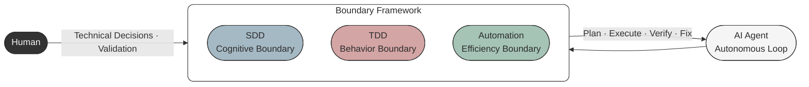
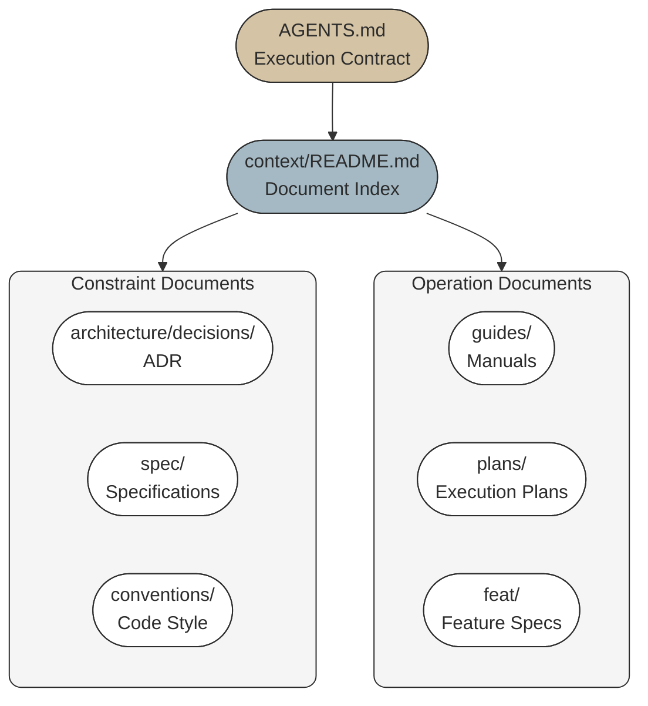
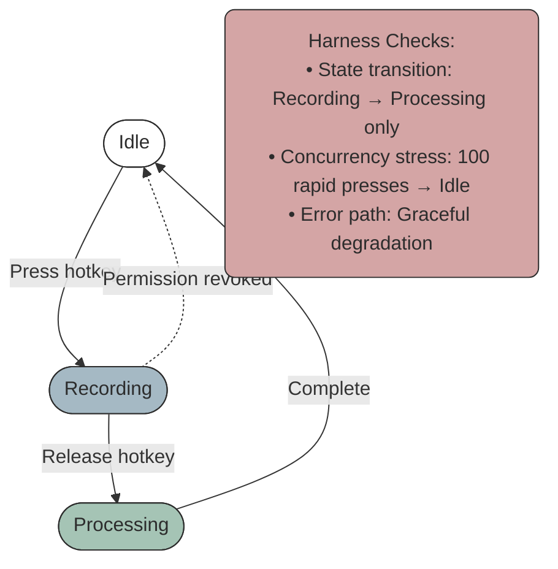
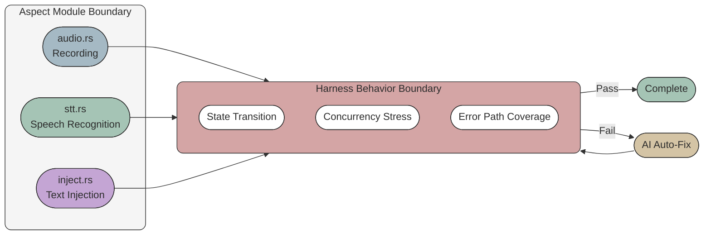

As a ten-year engineer, when developing [AriaType](https://github.com/joe223/AriaType), I conducted an experiment: **completing the entire project using Agentic Coding**. I only dictated goals and boundaries; the AI autonomously handled all the work: generating documentation, planning architecture, writing code, writing tests, and debugging issues.

The core of Agentic Coding is: an AI Agent autonomously loops within a bounded framework—planning, executing, verifying, fixing. I set the boundaries as three systems (SDD, TDD, Tool Automation), and the Agent ran autonomously within them. I only intervened at key points: making technical decisions and validating final results.


50 days, 62 commits, a working desktop application. This article documents how this approach was designed, how the Agent worked autonomously within boundaries, and what pitfalls I encountered.



## Why Start with AriaType

AriaType is a local-first voice keyboard: hold a hotkey to speak, release to automatically input text.

I knew almost nothing about desktop development. No Rust knowledge, never used Tauri, unfamiliar with system permissions and audio APIs. Following the traditional approach, I would need to study for a month before starting to write. By the time the project launched, the enthusiasm would have long faded.

So I conducted an experiment: don't study first, let AI do it directly. I make decisions, it writes code. If it failed, at most two weeks wasted. If it succeeded, I'd have a tool plus a new working method.

The result: the tool was built, and the method remained.

## Core Strategy 1: SDD (Spec-Driven Development)

Does the model know what to do? Yes—if you tell it.

In traditional development, requirements are scattered across chat histories, issues, verbal discussions. Every time AI intervenes, it needs to re-understand the context—inefficient and prone to misunderstanding. AriaType's approach: solidify the project's core constraints into a documentation system.

This is called **SDD—Spec-Driven Development**. It's a soft constraint: telling the model "what to do" and "how to do it", but without mandatory verification. Its purpose is to avoid repeating requirements in every prompt, allowing the model to quickly get into state at any moment.

### A Lesson Learned

At the beginning, I made a mistake with the speech recognition engine selection.

AI gave a suggestion: use bidirectional streaming, transmit audio to the cloud in real-time, recognize while speaking. Sounds reasonable, low latency, good experience. I agreed.

Two days later, the code was written. Testing revealed: Chinese recognition accuracy was poor. In streaming mode, the model could only guess words based on local context, getting confused with homophones.

I went back to ask AI: why recommend streaming? It said: because you asked for "the solution with lowest latency".

The problem was, I got the priorities wrong. AriaType's core scenario is Chinese input; accuracy matters more than latency. When describing requirements, I said "it needs to be fast", so AI did it "fast".

This lesson led me to establish a rule: **before writing code, write documentation first**. Not just casual notes, but systematic documentation—writing priorities like "accuracy > latency" so AI won't drift due to a vague prompt.

### AriaType's Documentation System

AriaType's documentation system is distributed throughout the project, forming a complete information architecture:

```
AriaType/
├── AGENTS.md                    # [Core] AI execution contract
├── README.md                    # Project description
├── CHANGELOG.md                 # Change history
├── .impeccable.md               # Design specification
│
├── context/                     # Progressive disclosure document map
│   ├── README.md                # Document index (entry point)
│   ├── architecture/            # System architecture
│   │   ├── README.md
│   │   ├── layers.md
│   │   ├── data-flow.md
│   │   └── decisions/           # ADR (Architecture Decision Records)
│   ├── spec/                    # Specifications
│   ├── conventions/             # Code style, design system
│   ├── guides/                  # Operation guides
│   ├── feat/                    # Feature specs (versioned)
│   ├── plans/                   # Execution plans
│   ├── quality/                 # Quality levels
│   └── reference/               # API reference
│
└── apps/desktop/
    └── CONTRIBUTING.md
```

Files fall into three roles:

**Entry Files** (what AI reads first):
- `AGENTS.md`—execution contract, defining "how to work", non-negotiable rules (Spec-first, TDD, forbid fabrication, forbid fake completion), recovery protocol (must stop after 3 failures), verification commands (`cargo test && cargo clippy`)
- `context/README.md`—document index, defining "where to find information"

**Constraint Files** (solidifying core rules):
- `architecture/decisions/`—ADR, decision context (format: Decision / Reason / Consequence)
- `spec/`—functional specifications, interface contracts
- `conventions/`—code style, design system

**Operation Files** (guiding specific behaviors):
- `guides/`—step-by-step operation manuals (how to add STT engine, how to debug)
- `plans/`—current execution plan
- `feat/`—feature specifications (versioned PRD)



The key to this structure is: when AI enters the project, it first reads AGENTS.md to understand non-negotiable rules, then finds needed deep documentation from context/README.md. Information is progressively disclosed—no need to read all documentation at once, dive in as needed.

### Limitations of SDD

SDD is a soft constraint. It can tell the model "what to do", but cannot tell "whether it's done correctly". For example, if you ask AI to implement "recording pause function", it can write code, but whether the code correctly handles state transitions, can work under concurrency, or will leak memory—these need hard constraints to verify.

## Core Strategy 2: TDD (Test-Driven Development)

Does the model know whether it's done correctly? No—unless you let it verify.

AriaType uses a broader concept—**Harness**. Harness is an automated verification framework: not just unit tests, but also state machine validation, boundary condition probing, error path coverage. Its role is to delineate the behavioral boundary of AI work—AI can freely operate within the harness, but any behavior crossing the boundary will be captured.

This is called **TDD—Test-Driven Development**. It's a hard constraint: giving the model a feedback loop through tests. Compared to SDD's soft constraint, TDD is more objective, more detailed, more mandatory.

### Harness vs Traditional Testing

For example, AriaType's recording module has a state machine: Idle → Recording → Processing → Idle. The harness I defined includes:



These are not traditional unit tests. They verify "whether system behavior matches expectations", not "whether a function returns the correct value". From this perspective, Harness can also be understood as a form of End-to-End testing—verifying complete state transitions rather than individual function return values.

### Harness and Aspect Coordination

Aspect is architecture-level decomposition: not by feature, but by **capability**. Recording is an aspect, STT is an aspect, text injection is an aspect. Each aspect has independent interfaces, independent state, independent error handling.



Aspect defines module boundaries, Harness defines behavioral boundaries. Together, AI's context is completely limited:

- Aspect tells AI: "You only need to modify `audio.rs`, no need to look at STT code"
- Harness tells AI: "After modification, these three validations must pass"

With these limits, AI's output quality improved significantly. The recording module—AI's first version passed all harness tests, no rework needed.

### Logging System: Letting the Model Locate Problems

Models looking at code may not solve problems well. Code is static; problems are dynamic. You need to give the model a window to observe system behavior—logs.

AriaType designed a complete logging system: structured fields, levels (error/warn/info/debug), full coverage of key paths. The most common prompt is:

> I found a feature not working, check the latest logs to see what's the specific reason.

The model reads logs, locates the problem, provides a fix. This greatly reduced my workload. I don't need to dig through code, debug, guess—logs already expose the symptom and location of the problem.

### Harness Design is Human's Job, Execution Can Be AI

AI can write test code, but designing harness requires human understanding of the system. What states does the state machine have? What happens under concurrency? How to degrade when permission is revoked? These questions have no standard answers, only humans can think clearly and write into spec.

But harness execution can be done by AI. AriaType's approach: I define harness scenarios (like "press hotkey 100 times rapidly"), AI writes specific test code. If harness fails, AI locates the problem itself, fixes it, until it passes.

Only after all harness passes do I do manual verification. At this point, I'm verifying "whether the harness itself is designed correctly", not "whether the code is correct".

## Core Strategy 3: Tool Automation

Not all work is suitable for models.

In AriaType, work like i18n validation is done through fixed scripts. These tasks have characteristics: repetitive, mechanical, clear rules. Letting models handle detailed matters is inefficient and error-prone.

The correct approach: **let Agent call tools according to rules**. Tools complete repetitive work; Agent only needs to focus on creative, decision-making work.

This is called **Tool Automation**. It delineates AI's efficiency boundary—knowing what's not worth letting AI do.

### AriaType's Automation Scripts

AriaType has several types of automation scripts:

**i18n check**: validates translation file completeness, format correctness, key omission. Pure mechanical work—script runs once, reports errors if any.

**Type check**: `pnpm typecheck`. TypeScript's type system is static; no need for AI to guess whether types are correct—the compiler tells you.

**Lint check**: `cargo clippy`, `oxlint`. Code style, potential bugs, best practices—lint tools cover most scenarios.

**Commit format check**: commit message format, type/scope validity—pre-commit hook auto-validates.

These tasks, if done by AI, would spend time understanding rules, checking files, generating reports—but results are predictable, process is mechanical. Using scripts is faster, more reliable, less error-prone.

### Essence of Tool Automation

The essence of tool automation: solidify "how to do", let tools execute. Agent only needs to know "when to call what tool", doesn't need to know how the tool works internally.

For example, i18n check—Agent only needs to know: after modifying translation files, run `pnpm check:i18n`. If error, read error message, fix. Agent doesn't need to know how this command internally checks key omission, validates JSON format—that's the tool's responsibility.

## What Can't Be Entrusted to AI in AriaType

Three core strategies cover most scenarios, but some things remain outside boundaries.

**Product Values**

AI won't tell you "whether AriaType users are willing to sacrifice 200ms latency for accuracy". It can analyze technical parameters, but can't make value judgments for you. I chose accuracy because I'm a user myself; I know 200ms latency doesn't affect usage, but typos are annoying.

**Error Fix Direction**

When tests fail, AI can locate bugs, but doesn't know "whether the feature itself is designed wrong". Sometimes code is fine, the requirements themselves were flawed. This judgment can only be made by humans.

**Long-term Maintainability**

AI writing code only looks at current requirements. It won't consider "whether current abstraction is enough when adding a new Polish engine three months later". AriaType eventually used a unified `SttEngine` trait—this decision was mine, because I imagined future extension scenarios.

**Complex System Intuition**

Some bugs hide in interactions. For example, hotkey conflicts with input method, recording thread suspended during permission popup. These problems have no obvious error logs; they need human intuition about system behavior. AI doesn't have this intuition.

## Summary: My Working Strategy

AriaType helped me form a working strategy. It's not a universal framework, just experience repeatedly validated in AriaType.

### Models Can't Do Everything for You

You need to know what you want to do, what trade-offs to make. Based on this goal or spec, we can design appropriate product-technical solutions.

AriaType's core goal is "accurate Chinese voice input". This goal determined STT engine selection, priority ranking, which features can compromise, which can't. If I don't know this goal, AI can't guess it—it will follow my casual request for "needs to be fast" and produce a solution with poor accuracy.

### Complex Systems Need Modularization

Models, like humans, have limits on attention and context. Complex systems can't expect models to solve perfectly in one go.

Reasonable architecture decomposition and modular design helps models solve problems. AriaType's four aspects—recording, STT, text polishing, text injection—I defined before writing code. Each aspect only communicates externally through one interface. When you ask AI to "implement recording module's pause function", it only needs to understand `audio.rs` and `recorder trait`, doesn't need to care how STT works.

Another benefit of modularization: low replacement cost. AriaType later added cloud STT; because interfaces were already defined, AI only needed to implement two methods to integrate.

### Importance of Logging System

Models looking at code may not solve problems well. Code is static; problems are dynamic.

A complete logging system lets models locate problems through logs. The most common prompt: "I found a feature not working, check the latest logs to see what's the specific reason." Model reads logs, locates problem, provides fix. This greatly reduced my workload.

### SDD Is Very Important

You can't just let the model go. Clarifying core goals and key constraints keeps the work from drifting.

SDD's role is defining "what to do" and "what not to do". "Forbid fabrication", "forbid fake completion", "Spec-first" in AGENTS.md—these rules prevent models from inventing APIs on their own, pretending to complete unverified work, skipping spec to write code directly.

Then supplemented with TDD, letting concrete implementation cover key scenarios. In any fix or change to the system, there are automated mandatory unit tests and integration tests to complete related checks and validations.

### Tool Automation Improves Efficiency

Repetitive, mechanical work done by tools, let Agent call tools according to rules. i18n check, type check, lint check, commit format check—these aren't worth letting AI do. Tools are faster, more reliable, less error-prone.

## Limitations and Costs

AriaType taught me a few things:

**Not All Projects Fit**

If you're working on a completely new field where even the problem domain is unclear, AI can't help. It needs clear constraints and goals. AriaType could do this because I knew what I wanted—a voice keyboard. If I didn't know what a "voice keyboard" should look like, AI couldn't guess it either.

**Harness Design Has Cost**

Defining a good harness requires clear understanding of system behavior. AriaType's recording module—I spent half an hour thinking through all state machine transition paths. If you're not familiar enough with the problem domain, harness might miss key boundaries; AI's code "passes harness but still has bugs".

**Code Volume ≠ Progress**

AriaType has 24,000 lines of Rust, but 30% was deleted later. AI writes a lot, writes fast, but rework rate is also high. Don't look at line count, look at whether features are stable.

**Still Learning How to Ask Questions**

Good prompts aren't about writing more, but writing precisely. I spent three weeks learning how to describe a bug: not "it crashed", but "under X conditions, Y behavior doesn't match Z expectation, error log is W". Question quality directly determines output quality.

## Final Words

AriaType is now a tool I use every day. It's not a demo; it's a real product. But the process of building it gave me more than the product itself.

I don't think "not writing code" is the only future. For certain problems, hand-written code is still the best thinking tool. But for scenarios where "I know what I want, just don't know how to implement"—like AriaType—letting AI try and fail while humans make decisions might be a more natural division of labor.

The key is drawing clear boundaries: SDD delineates cognitive boundary, TDD delineates behavioral boundary, tool automation delineates efficiency boundary. With these three done well, AI can help you complete work within boundaries. Boundaries drawn poorly, AI will help you create chaos.

Keep experimenting, keep refining the boundaries.

Finally, this document itself was also completed through dictation with [AriaType](https://github.com/joe223/AriaType)—I didn't manually type. This is another application scenario of Agentic Coding: not just code, documents can also be generated through dictation.