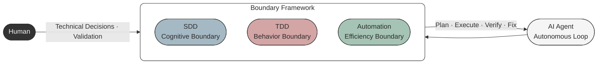
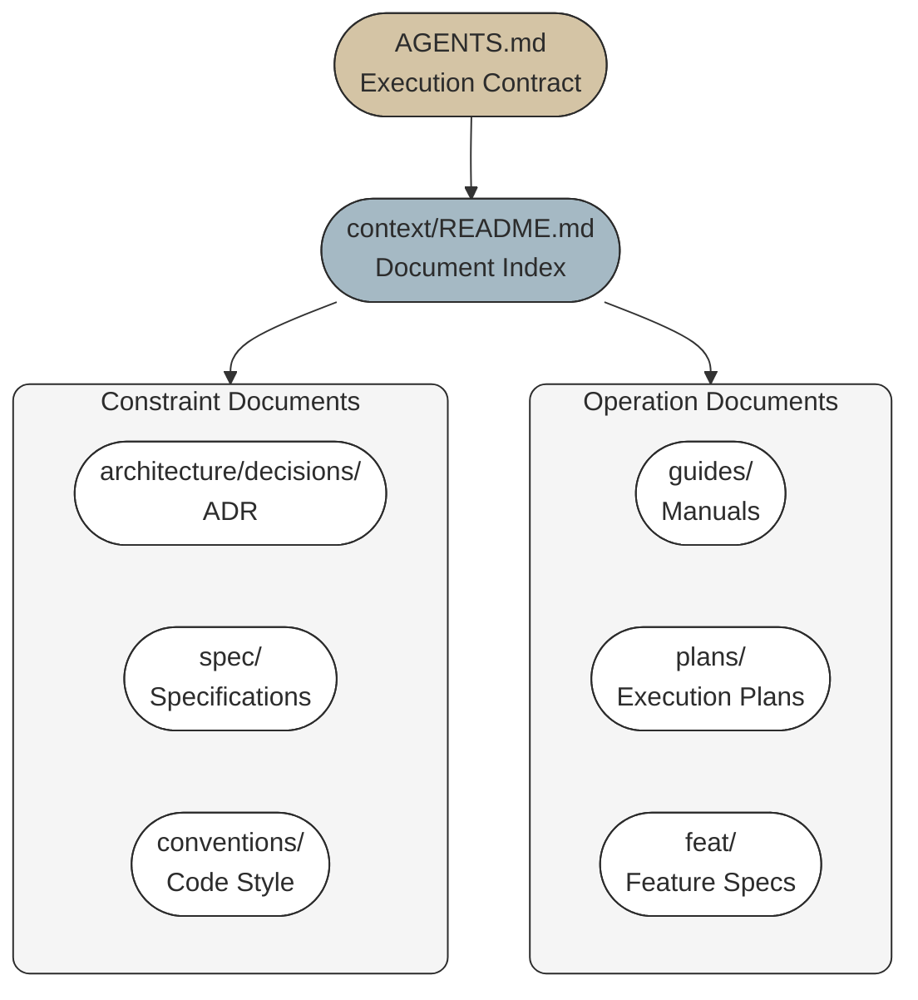
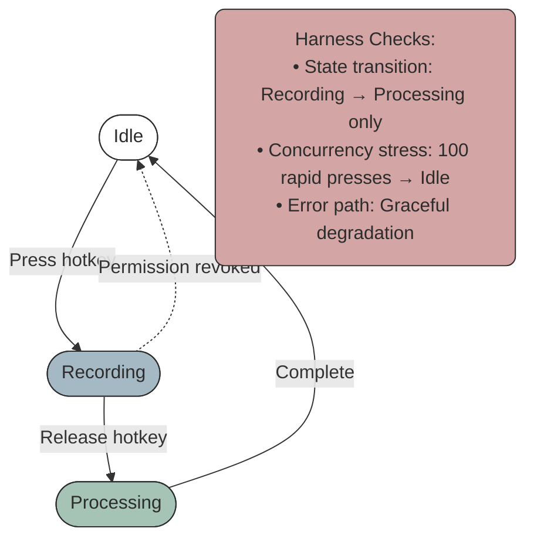
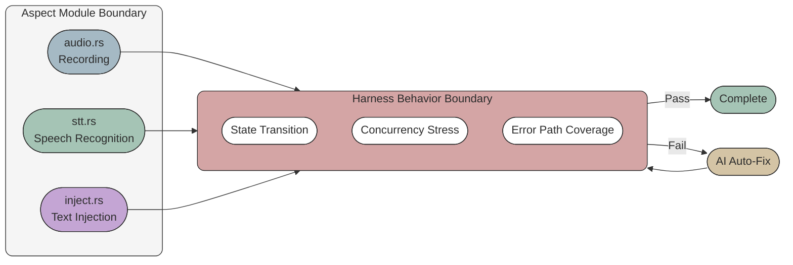
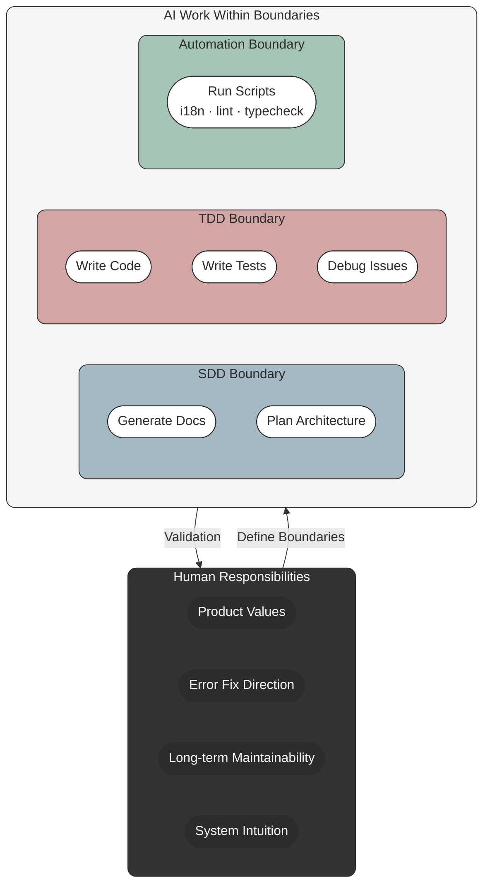

我在开发 [AriaType](https://github.com/joe223/AriaType) 时做了一个实验：**用 Agentic Coding 的方式完成整个项目**——我只口述目标和边界，AI 自主完成全部工作：生成文档、规划架构、写代码、写测试、调试问题。

Agentic Coding 的核心是：AI Agent 在一个有边界的框架内自主循环——规划、执行、验证、修正。我设定的边界是三套体系（SDD、TDD、工具自动化），Agent 在边界内自主运行。我只在关键节点介入：做技术选型的决策、验收最终结果。

50 天，62 个 commit，一个能用的桌面应用。这篇文章记录的是这套思路是怎么设计的、怎么让 Agent 在边界内自主工作的、踩了什么坑。



## 为什么从 AriaType 开始尝试

AriaType 是一个本地优先的语音键盘：按住快捷键说话，松开自动输入文字。

我对桌面开发几乎一无所知。不会 Rust，没用过 Tauri，不了解系统权限和音频 API。按照以前的方式，我需要先学一个月，再开始写。等项目启动，热情早就没了。

所以我做了一个实验：不先学，直接让 AI 做。我做决定，它写代码。如果失败了，最多浪费两周。如果成了，我就得到了一个工具，外加一套新的工作方法。

结果是：工具做成了，方法也留下了。

## 核心策略一：SDD（Spec-Driven Development）

模型知道该做什么吗？知道——前提是你告诉它。

传统开发中，需求散落在聊天记录、issue、口头讨论里。AI 每次介入都要重新理解上下文，效率低，而且容易理解偏差。AriaType 的做法是：把项目的核心约束固化下来，形成文档体系。

这叫 **SDD——Spec-Driven Development**。它是一种软约束：告诉模型"做什么"和"怎么做"，但不强制验证。它的作用是避免每次 prompt 中重复要求，让模型在任何时刻都能快速进入状态。

### 一个踩坑的教训

最开始的语音识别引擎选型，我踩了坑。

AI 给了个建议：用 bidirectional streaming，实时传音频到云端，边说边识别。听起来合理，延迟低，体验好。我同意了。

两天后代码写完了。我测试发现：中文识别准确率很差。streaming 模式下，模型只能基于局部上下文猜词，遇到同音字就乱。

我回去问 AI：为什么推荐 streaming？它说：因为你问的是"延迟最低的方案"。

问题是，我搞错了优先级。AriaType 的核心场景是中文输入，准确率比延迟重要。我描述需求时说"要快"，AI 就按"快"来做了。

这个教训让我定了一条规则：**开始写代码前，先写文档**。不是随便记两句，是成体系的文档——把"准确率 > 延迟"这种优先级写进去，让 AI 不会因为一句模糊的 prompt 就跑偏。

### AriaType 的文档体系

AriaType 的文档体系分布在项目各处，形成一个完整的信息架构：

```
AriaType/
├── AGENTS.md                    # [核心] AI 执行合约
├── README.md                    # 项目说明
├── CHANGELOG.md                 # 变更历史
├── .impeccable.md               # 设计规范
│
├── context/                     # 渐进式披露的文档地图
│   ├── README.md                # 文档索引（入口）
│   ├── architecture/            # 系统架构
│   │   ├── README.md
│   │   ├── layers.md
│   │   ├── data-flow.md
│   │   └── decisions/           # ADR（技术决策记录）
│   ├── spec/                    # 规格说明
│   ├── conventions/             # 代码风格、设计系统
│   ├── guides/                  # 操作指南
│   ├── feat/                    # 功能规格（版本化）
│   ├── plans/                   # 执行计划
│   ├── quality/                 # 质量等级
│   └── reference/               # API参考
│
└── apps/desktop/
    └── CONTRIBUTING.md
```

文件分三类角色：

**入口文件**（AI 首先读的）：
- `AGENTS.md`——执行合约，定义"怎么工作"，不可协商的规则（Spec-first、TDD、禁止 fabrication、禁止 fake completion），恢复协议（3 次失败必须停止），验证命令（`cargo test && cargo clippy`）
- `context/README.md`——文档索引，定义"去哪找信息"

**约束文件**（固化核心规则）：
- `architecture/decisions/`——ADR，决策上下文（格式：Decision / Reason / Consequence）
- `spec/`——功能规格、接口契约
- `conventions/`——代码风格、设计系统

**操作文件**（指导具体行为）：
- `guides/`——step-by-step 操作手册（如何新增 STT 引擎、如何调试）
- `plans/`——当前执行计划
- `feat/`——功能规格（版本化的 PRD）



这个结构的关键是：AI 进入项目时，先读 AGENTS.md 理解不可协商的规则，再从 context/README.md 找需要的深度文档。信息是渐进披露的——不需要一次性读完全部文档，按需深入。

### SDD 的局限

SDD 是软约束。它能告诉模型"做什么"，但不能告诉模型"做得对不对"。比如你让 AI 实现"录音暂停功能"，它能写代码，但代码是否正确处理了状态转换、是否能在并发下工作、是否会内存泄漏——这些需要硬约束来验证。

## 核心策略二：TDD（Test-Driven Development）

模型知道做得对不对吗？不知道——除非你让它验证。

AriaType 用的是更宽泛的概念——**Harness**。Harness 是自动化验证框架：不只是单元测试，还包括状态机校验、边界条件探测、错误路径覆盖。它的作用是划定 AI 工作的行为边界——AI 可以在 harness 内自由发挥，但任何超出边界的行为都会被捕获。

这叫 **TDD——Test-Driven Development**。它是一种硬约束：通过测试让模型获得反馈循环。相比 SDD 的软性约束，TDD 更客观、更细节、更强制。

### Harness vs 传统测试

举个例子，AriaType 的录音模块有一个状态机：Idle → Recording → Processing → Idle。我定义的 harness 包括：



这些不是传统的单元测试。它们验证的是"系统行为是否符合预期"，而不是"某个函数返回正确值"。从这个角度看，Harness 也可以理解为一种 End-to-End 测试——验证的是完整的状态流转，而非单个函数的返回值。

### Harness 和 Aspect 的配合

Aspect 是架构层面的拆分：不按 feature 拆分，按**能力**拆分。录音是一个 aspect，STT 是一个 aspect，文本注入是一个 aspect。每个 aspect 有独立的接口、独立的状态、独立的错误处理。



Aspect 定义模块边界，Harness 定义行为边界。两者配合，AI 的上下文被彻底限定：

- Aspect 告诉 AI："你只需要改 `audio.rs`，不需要看 STT 代码"
- Harness 告诉 AI："你改完之后，这三条校验必须通过"

限定之后，AI 的输出质量显著提升。AriaType 的录音模块，AI 第一版就通过了全部 harness，没有返工。

### 日志系统：让模型定位问题

模型看代码不一定能很好地解决问题。代码是静态的，问题是动态的。你需要给模型一个观察系统行为的窗口——日志。

AriaType 设计了完善的日志系统：结构化字段、分级（error/warn/info/debug）、关键路径全覆盖。最常见的 prompt 是：

> 我发现某功能不工作，你检查一下最新的日志，看看具体原因是什么。

模型读日志，定位问题，给出修复方案。这极大地降低了我的工作负担。我不需要自己去翻代码、调试、猜测——日志已经把问题的症状和位置暴露出来了。

### Harness 设计是人的事，执行可以是 AI

AI 能写测试代码，但设计 harness 需要人对系统的理解。状态机有哪些状态？并发场景下会发生什么？权限被剥夺时怎么降级？这些问题没有标准答案，只能人想清楚，写进 spec。

但 harness 的执行可以让 AI 来做。AriaType 的做法是：我定义 harness 的场景（比如"快速连按快捷键 100 次"），AI 写具体的测试代码。如果 harness 失败，AI 自己定位问题，自己修，直到通过。

只有 harness 全部通过后，我才做手动验证。这时候验证的是"harness 本身设计得对不对"，不是"代码对不对"。

## 核心策略三：工具自动化

并不是所有工作都适合模型去做。

在 AriaType 项目中，像 i18n 的检查校验这类工作，我们是通过固定脚本完成的。这些事情的特点是：重复性、机械性、规则明确。让模型处理事无巨细的事情，效率低，而且容易出错。

正确的做法是：**让 Agent 按规则去调用工具**。工具把重复性的事情做完，Agent 只需要关注创造性、决策性的工作。

这叫 **工具自动化**。它划定的是 AI 的效率边界——知道什么不值得让 AI 做。

### AriaType 的自动化脚本

AriaType 有几类自动化脚本：

**i18n 检查**：检查翻译文件的完整性、格式正确性、key 是否遗漏。这是纯机械的工作，脚本跑一遍，有问题就报错。

**类型检查**：`pnpm typecheck`。TypeScript 的类型系统是静态的，不需要 AI 去猜测类型是否正确——编译器会告诉你。

**lint 检查**：`cargo clippy`、`oxlint`。代码风格、潜在 bug、最佳实践——lint 工具覆盖了大部分场景。

**commit 格式检查**：commit message 的格式、type/scope 的合法性——pre-commit hook 自动校验。

这些事情，如果让 AI 去做，它会花时间理解规则、检查文件、生成报告——但结果是可预测的，过程是机械的。用脚本做，更快，更可靠，更不容易出错。

### 工具自动化的本质

工具自动化的本质是：把"怎么做"固化下来，让工具执行。Agent 只需要知道"什么时候调用什么工具"，不需要知道工具内部怎么工作。

比如 i18n 检查，Agent 只需要知道：修改翻译文件后，跑 `pnpm check:i18n`。如果报错，看错误信息，修正。Agent 不需要知道这个命令内部是怎么检查 key 遗漏、是怎么校验 JSON 格式的——那是工具的职责。

## AriaType 里什么不能交给 AI

三个核心策略覆盖了大部分场景，但有些事情仍然在边界之外。

**产品价值观**

AI 不会告诉你"AriaType 的用户愿不愿意为了准确率牺牲 200ms 延迟"。它能分析技术参数，但不能替你做价值判断。我选了准确率，因为我自己就是用户，我知道延迟 200ms 不影响使用，但错别字会很烦。

**错误修正的方向**

当测试失败时，AI 能定位 bug，但它不知道"这个功能本身是不是设计错了"。有时候代码没问题，是需求想歪了。这种判断只能人来下。

**长期的维护性**

AI 写代码时只看当前需求。它不会考虑"三个月后加一个新的 Polish 引擎，现在的抽象够不够用"。AriaType 最终用了统一的 `SttEngine` trait，这个决定是我做的，因为我想象了未来的扩展场景。

**复杂系统的直觉**

有些 bug 藏在交互里。比如快捷键和输入法冲突、权限弹窗时录音线程被挂起。这些问题没有明显的错误日志，需要人对系统行为的直觉。AI 没有这种直觉。

## 总结：我的工作策略

AriaType 让我形成了一套工作策略。它不是什么通用框架，只是在 AriaType 里反复验证过的经验。

### 模型不能替你做所有事情

你需要知道你想做什么，你需要做什么样的取舍。基于这个目标或 spec，我们才能设计出合适的产品技术方案。

AriaType 的核心目标是"中文语音输入准确"。这个目标决定了 STT 引擎选型、决定了优先级排序、决定了哪些功能可以妥协、哪些不能。如果我不知道这个目标，AI 也猜不出来——它会按我随口说的"要快"去做，然后得到一个准确率很差的方案。

### 复杂系统需要模块化

模型和人一样，注意力和上下文都有上限。复杂系统不能指望模型一次性完美解决。

合理的架构拆分和模块化设计有助于模型解决问题。AriaType 的四个 aspect——录音、STT、文本润色、文本注入——我在写代码前就划好了。每个 aspect 只通过一个接口和外部通信。你让 AI "实现录音模块的暂停功能"，它只需要理解 `audio.rs` 和 `recorder trait`，不需要关心 STT 怎么工作。

模块化的另一个好处是替换成本低。AriaType 后来加了 cloud STT，因为接口已经定义好了，AI 只需要实现两个方法就能接进去。

### 日志系统的重要性

模型看代码不一定能很好地解决问题。代码是静态的，问题是动态的。

完善的日志系统让模型通过日志定位问题。最常见的 prompt："我发现某功能不工作，你检查一下最新的日志，看看具体原因是什么。"模型读日志，定位问题，给出修复方案。这极大地降低了我的工作负担。

### SDD 非常重要

你不能撒手让模型去做。明确核心目标和关键约束，才能让整个工作不走偏。

SDD 的作用是定义"做什么"和"不做什么"。AGENTS.md 里的"禁止 fabrication"、"禁止 fake completion"、"Spec-first"——这些规则让模型不会自作聪明地发明 API、不会假装完成没验证的工作、不会跳过 spec 直接写代码。

然后辅以 TDD，让具体实现覆盖关键场景。在系统的任何修复或更改中，都有自动化的强制单元测试和集成测试来完成相关检查校验。

### 工具自动化提升效率

重复性、机械性的事情用工具完成，让 Agent 按规则调用工具。i18n 检查、类型检查、lint 检查、commit 格式检查——这些事情不值得让 AI 去做。工具更快、更可靠、更不容易出错。

## 局限与代价

AriaType 让我明白几件事：

**不是所有项目都适合**

如果你在做的是一个全新的领域，连问题域都不清楚，AI 帮不上忙。它需要明确的约束和目标。AriaType 之所以能这么做，是因为我知道我要什么——一个语音键盘。如果我不知道"语音键盘"应该长什么样，AI 也猜不出来。

**Harness 设计有成本**

定义一个好的 harness，需要对系统行为有清晰的理解。AriaType 的录音模块，我花了半小时才想清楚状态机的所有转换路径。如果你对问题域不够熟悉，harness 可能会漏掉关键边界，AI 的代码"通过了 harness 但仍然有 bug"。

**代码量不等于进度**

AriaType 有 24,000 行 Rust，但其中有 30% 是后来删掉的。AI 写得多，也写得快，但返工率也高。不要看行数，看功能是否稳定。

**我还在学习怎么提问**

好的 prompt 不是写得多，是写得准。我花了三周才学会怎么描述一个 bug：不是"它崩了"，而是"在 X 条件下，Y 行为不符合 Z 预期，错误日志是 W"。提问的质量直接决定输出的质量。

## 写在最后

AriaType 现在是我每天都在用的工具。它不是一个 demo，是一个真实的产品。但建造它的过程，比产品本身更让我有收获。

我不觉得"不写代码"是未来的唯一方式。对于某些问题，手写代码仍然是最好的思考工具。但对于"我知道要什么，只是不知道怎么实现"的场景——比如 AriaType——让 AI 去试错，人来做决定，可能是更自然的分工。

关键是划清楚边界：SDD 划定认知边界，TDD 划定行为边界，工具自动化划定效率边界。这三件事做好了，AI 就能在边界内帮你把事情做完。边界划不好，AI 就会帮你制造混乱。



然后继续试，继续调整边界。

最后，这篇文档本身也是通过 [AriaType](https://github.com/joe223/AriaType) 口述完成的——我没有手动打字。这是 Agentic Coding 的另一个应用场景：不只是代码，文档也可以用口述的方式生成。